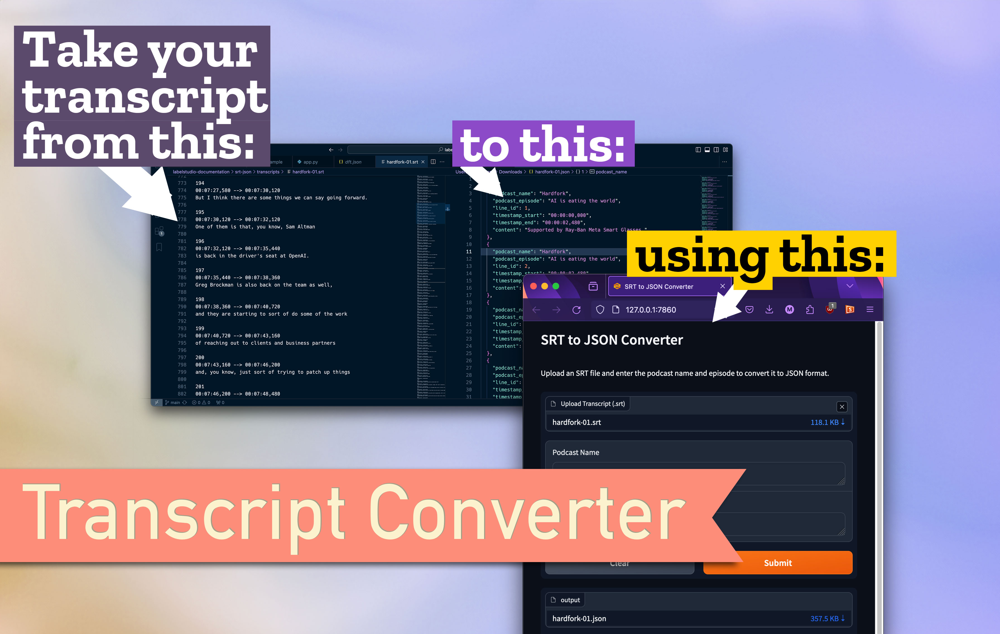

# Transcript to JSON Converter



### What is it?

This app turns .srt (Subrip Text) format transcript files into JSON. [SRT](https://en.wikipedia.org/wiki/SubRip) is one of the formats supported by the [Whisper API](https://github.com/openai/whisper), which is OpenAI's open-source Speech to Text library.

### Why is it useful?

* Allows you to easily import transcripts into web apps
* Allows you to convert your transcript to a data format suitable for ML model training and fine tuning.

### Try it

[Use the app on Hugging Face Spaces](https://huggingface.co/spaces/mikemoz/srt_to_json_converter)

### Modify It

Your JSON structure will no doubt be different than what I used. To get it into your desired JSON format:

* Clone this repo
* Do what you want with app, but if all you need is to modify the JSON output, focus on this line:

```json
transcripts.append({'podcast_name': podcast_name, 'podcast_episode': podcast_episode, 'line_id': id, 'timestamp_start': timestamp_start, 'timestamp_end': timestamp_end, 'content': transcript})
```

* Change that JSON structure 🔼 so that the object keys are whatever you need them to be.

### Run it Locally

```bash
python app.py
```

### Learn how to use it in ML model training

[Watch this video](https://youtu.be/5HWeVZXQ-E4), where I discuss why you might want to fine tune a model (vs using RAG), the steps in model training, preparing data for annotation, and how to use Label Studio (open source) for that annotation.